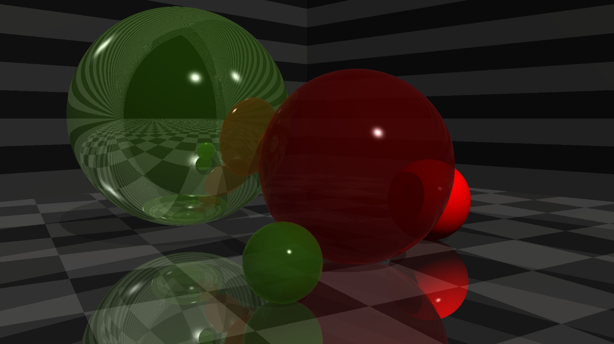

# What Is it About?

This is a complete implementation of Whitted Ray Tracing algorithm made as a hobby project. It is completely implemented in Java, which I admit not the best choice of language, but the syntax is convenient and it assist me in learning.

The performance isn't great, there's a lot of room for optimization, but at least this is working. This is some pretty picture it is capable of rendering :

